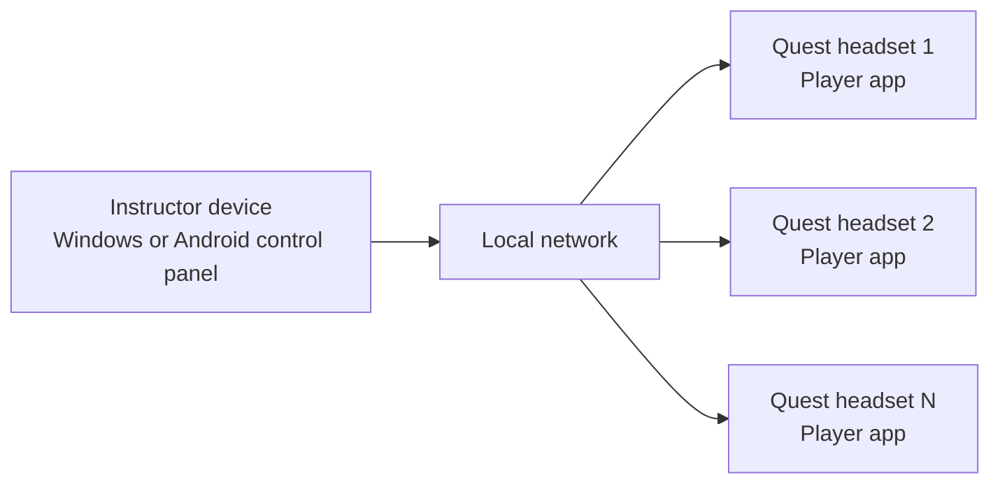

# VR Group Videoplayer

VR Group Videoplayer is a classroom video playback system for Meta Quest headsets. It helps one instructor or lab administrator prepare videos, discover headsets on the local network, and start synchronized playback from a simple control panel.

This repository is the public home for downloads, setup guides, and technical reference material.

## Downloads

Download the latest public build from [GitHub Releases](https://github.com/Chikanut/VR-Group-Videoplayer/releases/latest).

Release assets use these stable names:

| File | Use it for |
|---|---|
| `VRClassroomPlayer-Quest.apk` | Install on each Meta Quest headset |
| `VRClassroomControlPanel-Android.apk` | Run the control panel on an Android phone or tablet |
| `VRClassroomControlPanel-Windows.exe` | Run the control panel on a Windows PC |

If you are not sure where to start, download:

- `VRClassroomPlayer-Quest.apk` for every headset
- one control panel app for the instructor device: Android or Windows

## What This System Does

- discovers VR players on the same local network
- shows which headset is online and ready
- lets you configure lessons by video filename
- starts, pauses, stops, and recenters playback across the class
- supports both flat 2D and 360 video playback

## Who It Is For

- schools and training centers using Meta Quest headsets
- teachers who need one-screen playback control
- lab administrators who prepare devices before a lesson

## How It Works

1. Install the Quest player on each headset.
2. Install the control panel on a Windows PC or Android device.
3. Put lesson videos onto each headset in `/sdcard/Movies/`.
4. Connect all devices to the same local network.
5. Open the control panel, discover devices, configure video filenames, and start playback.

## Documentation

### English

- [Overview](docs/en/overview.md)
- [Downloads](docs/en/downloads.md)
- [Quick Start](docs/en/quick-start.md)
- [Set Up the Control Panel](docs/en/setup-control-panel.md)
- [Set Up the Quest Player](docs/en/setup-player.md)
- [Prepare Videos](docs/en/prepare-videos.md)
- [Daily Use](docs/en/daily-use.md)
- [Networking and Troubleshooting](docs/en/networking-troubleshooting.md)

### Українська

- [Огляд](docs/uk/overview.md)
- [Завантаження](docs/uk/downloads.md)
- [Швидкий старт](docs/uk/quick-start.md)
- [Налаштування панелі керування](docs/uk/setup-control-panel.md)
- [Налаштування Quest player](docs/uk/setup-player.md)
- [Підготовка відео](docs/uk/prepare-videos.md)
- [Щоденне використання](docs/uk/daily-use.md)
- [Мережа та усунення проблем](docs/uk/networking-troubleshooting.md)

## Need Help?

If devices are not discovered:

- confirm all devices are on the same Wi-Fi or LAN
- make sure the control panel and headsets are in the same subnet
- check Windows firewall or router isolation settings

If playback does not start:

- make sure the same filename exists on the headset
- confirm the headset player app is open and online
- verify the selected mode matches the video type

If a video appears missing:

- copy the file to `/sdcard/Movies/`
- use only the filename in the control panel, not the full path
- re-open the player app or refresh the device state

See the full troubleshooting guides in [English](docs/en/networking-troubleshooting.md) and [Ukrainian](docs/uk/networking-troubleshooting.md).

## For Maintainers

- [Release checklist](docs/releasing.md)
- [Release notes template](docs/release-notes-template.md)
- [Technical player API reference](PlayerAPI.md)
